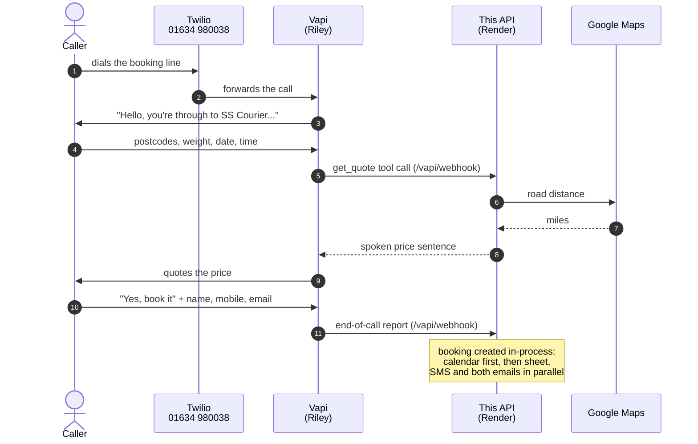
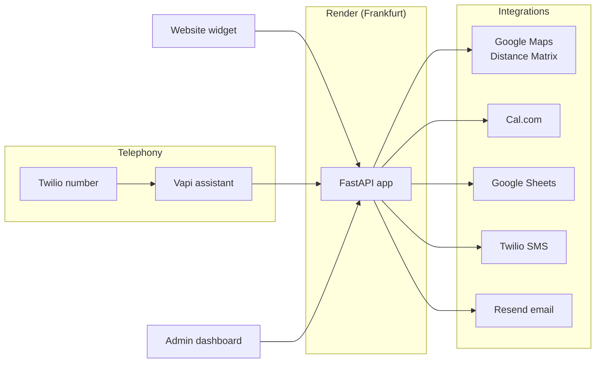

# SS Courier — AI Voice Booking Line

An AI telephone assistant that answers calls for **SS Courier** (Salus Securities
& Couriers Limited), a same-day courier company in Kent, 24 hours a day. It
collects the job details, prices the job from real road mileage and, when the
caller accepts, books it end to end with no human involved.

**Live line:** 01634 980038
**Service:** `https://courier-booking-api.onrender.com`
**Status:** in production, tested with real phone calls

---

## Contents

- [What it does](#what-it-does)
- [How a call flows](#how-a-call-flows)
- [Architecture](#architecture)
- [Pricing rules](#pricing-rules)
- [Project structure](#project-structure)
- [API endpoints](#api-endpoints)
- [Getting started locally](#getting-started-locally)
- [Configuration](#configuration)
- [Testing](#testing)
- [Deployment](#deployment)
- [Configuring the voice assistant](#configuring-the-voice-assistant)
- [Design principles](#design-principles)
- [Security](#security)
- [Known limitations](#known-limitations)
- [Documentation](#documentation)

---

## What it does

A customer rings the booking line. An AI assistant, **Riley**, answers in a
British voice and asks for:

1. Collection postcode
2. Delivery postcode
3. Load weight in kilograms
4. Collection date
5. Collection time

It works out the road distance with Google Maps, quotes a price and asks
whether to book. If the caller says yes, it takes their name, mobile number and
email, and the system then:

| Step | Service |
|---|---|
| Adds the job to the calendar | Cal.com |
| Writes a row to the bookings spreadsheet | Google Sheets |
| Texts the customer their reference and price | Twilio (sender ID `SSCourier`) |
| Emails the customer a confirmation | Resend (`bookings@sscourierbookings.com`) |
| Emails the office a new-booking notification | Resend |

The assistant hands the call to a person instead of quoting when the load is
over **790 kg** (the van's capacity), or whenever the caller asks for someone.

It also includes:

- **A password-protected admin dashboard** listing recent bookings
- **An embeddable website quote widget** that gives visitors an instant price
- **Failure alerts** emailed to the office whenever a booking cannot be
  completed automatically

---

## How a call flows



When a caller asks for a person, or the load is over capacity, the assistant
calls `transfer_to_human` and the call is put through to the owner's mobile.

---

## Architecture



| Layer | Technology |
|---|---|
| Web framework | FastAPI 0.141, Uvicorn |
| Language | Python 3.14 |
| HTTP client | httpx (fully async) |
| Voice AI | Vapi: GPT-4.1, Azure `en-GB-SoniaNeural` voice |
| Telephony and SMS | Twilio REST API |
| Calendar | Cal.com API v2 |
| Booking log | Google Sheets REST API, service-account auth |
| Email | Resend HTTP API |
| Hosting | Render, `starter` plan, Frankfurt region |

No official SDKs are used for Twilio, Google Sheets or email. Those SDKs are
synchronous and would block the event loop while a live call is waiting, so
each integration calls the provider's REST API directly with `httpx`.

---

## Pricing rules

Confirmed by the client on 16 September 2026. Defined in
[`api/config.py`](api/config.py) and applied by `calculate_price()` in
[`api/main.py`](api/main.py).

| Rule | Value |
|---|---|
| Starting charge | None, the price is the mileage |
| Up to and including 45 miles | £3.00 per mile |
| Over 45, under 100 miles | £2.00 per mile |
| 100 miles and over | £1.80 per mile |
| Loads over 400 kg | +10% |
| Loads over 790 kg | Not quoted, transferred to a person |

The rate applies to the **whole journey**: 20 miles × £3.00 = £60.00. As a
result, a 45-mile job (£135) costs more than a 46-mile job (£92). This follows
the client's specification and is covered by tests.

---

## Project structure

```
hey101231/
├── api/
│   ├── main.py              # FastAPI app: pricing, Vapi webhooks, booking,
│   │                        #   website widget and admin dashboard
│   ├── config.py            # Reads .env once; settings, business rules,
│   │                        #   and per-integration "is configured" flags
│   ├── utils.py             # Spoken date/time parsing and speech formatting
│   └── services/
│       ├── booking_ref.py   # CRR-YYYYMMDD-XXXX booking references
│       ├── calcom.py        # Calendar bookings and availability
│       ├── sheets.py        # Google Sheets log with a local JSONL fallback
│       ├── twilio_sms.py    # SMS, UK number normalisation, call transfer
│       └── email_sender.py  # Resend email and message templates
├── scripts/
│   └── configure_vapi.py    # Pushes the assistant config (prompt, voice,
│                            #   tools, structured-data schema) to Vapi
├── tests/
│   ├── conftest.py          # Mocks every external call; tests never spend money
│   ├── test_booking.py      # Booking, admin, references, widget, rate limit
│   ├── test_vapi_webhook.py # Every Vapi event type and payload shape
│   ├── test_regressions.py  # Faults found in production, pinned for good
│   ├── simulate_call.py     # Walks a full call against a running server
│   └── test_quote.http      # Manual requests for the VS Code REST Client
├── docs/                    # Setup, deployment, handover and client guides
├── logs/                    # Local JSONL logs (git-ignored)
├── render.yaml              # Render blueprint
└── requirements.txt
```

---

## API endpoints

### Public

| Method | Path | Purpose |
|---|---|---|
| `GET` | `/health` | Liveness check, plus which integrations are configured |
| `POST` | `/quote` | Price a job. Rate-limited to 30 requests/minute per IP |
| `GET` | `/widget/quote` | Embeddable instant-quote page for the client's website |

### Vapi

| Method | Path | Purpose |
|---|---|---|
| `POST` | `/vapi/webhook` | **The URL configured in Vapi.** Routes every event by `message.type`. Checks the `x-vapi-secret` header |
| `POST` | `/vapi/quote` | Price a job and return a sentence to speak |
| `POST` | `/vapi/transfer` | Hand the call to a person |
| `POST` | `/vapi/end-of-call` | Log the call and create the booking if the caller accepted |

The last three are called internally by `/vapi/webhook`, and are also exposed
directly for testing.

### Booking

| Method | Path | Purpose |
|---|---|---|
| `POST` | `/booking/create` | Create a booking: calendar, sheet, SMS, both emails |
| `POST` | `/booking/check-availability` | Check whether a calendar slot is free |
| `POST` | `/booking/alert-failure` | Email the office about a booking that failed |
| `GET` | `/booking/{reference}` | Look up a booking by reference |

### Admin (HTTP Basic auth)

| Method | Path | Purpose |
|---|---|---|
| `GET` | `/admin` | Bookings dashboard, refreshes every 60 seconds |
| `GET` | `/admin/bookings` | The JSON behind the dashboard |

Interactive API docs are generated automatically at `/docs`.

---

## Getting started locally

Requires **Python 3.14** on Windows. The commands use the project's `venv`.

```powershell
# 1. Create the virtual environment and install dependencies
python -m venv venv
.\venv\Scripts\python.exe -m pip install -r requirements.txt

# 2. Create your .env from the template, then fill in the values
copy .env.example .env

# 3. Run the server with auto-reload
.\venv\Scripts\python.exe -m uvicorn api.main:app --reload
```

Then open:

- <http://localhost:8000/health>: the `integrations` block shows which
  services still need credentials
- <http://localhost:8000/docs>: the interactive API documentation
- <http://localhost:8000/widget/quote>: the website quote widget
- <http://localhost:8000/admin>: the dashboard, using `ADMIN_USERNAME` and `ADMIN_PASSWORD`

Everything degrades gracefully. The app starts and responds with any
integration unconfigured, and logs a warning instead of failing.

---

## Configuration

All settings come from `.env`, read once in [`api/config.py`](api/config.py).
Never commit `.env` or `api/service-account.json`; both are git-ignored.

| Variable | Purpose |
|---|---|
| `GOOGLE_MAPS_API_KEY` | Distance Matrix API key |
| `GOOGLE_SHEETS_ID` | ID of the bookings spreadsheet |
| `GOOGLE_SHEETS_TAB` | Tab name, default `Bookings` |
| `GOOGLE_SERVICE_ACCOUNT_JSON` | Path to the service-account key file |
| `TWILIO_ACCOUNT_SID` | Twilio account SID |
| `TWILIO_AUTH_TOKEN` | Twilio auth token |
| `TWILIO_FROM_NUMBER` | SMS sender, currently the alphanumeric ID `SSCourier` |
| `CAL_API_KEY` | Cal.com API key |
| `CAL_EVENT_TYPE_ID` | Cal.com event type that bookings are created against |
| `VAPI_PRIVATE_KEY` | Used by `scripts/configure_vapi.py` |
| `VAPI_SERVER_SECRET` | Shared secret Vapi sends as `x-vapi-secret` |
| `RESEND_API_KEY` | Resend API key (sending access only) |
| `RESEND_FROM_EMAIL` | Sender address on the verified domain |
| `EMAIL_FROM_NAME` | Display name on outgoing email |
| `CLIENT_NAME` | Business name used in email signatures |
| `CLIENT_EMAIL` | Office inbox for booking notifications and alerts |
| `CLIENT_PHONE_NUMBER` | Owner's mobile, where transfers ring |
| `CLIENT_PUBLIC_NUMBER` | Number shown on the website widget's call button |
| `ADMIN_USERNAME` / `ADMIN_PASSWORD` | Admin dashboard login |
| `NGROK_URL` | The service's public base URL (the name is historical) |

Values beginning `your_`, or equal to `changeme`, are treated as unset.

---

## Testing

```powershell
.\venv\Scripts\python.exe -m pytest tests\ -q
```

**129 tests, under one second, fully offline.** An autouse fixture in
[`tests/conftest.py`](tests/conftest.py) replaces every external call with a
fake, so the suite never sends a real text, creates a real calendar entry or
spends money on Google Maps. Test dates are generated relative to today, so
the suite does not start failing as time passes.

[`tests/test_regressions.py`](tests/test_regressions.py) holds a test for each
fault found in production. Every test there names the incident it prevents.

To play out a complete call against a running server:

```powershell
.\venv\Scripts\python.exe tests\simulate_call.py              # books for real
.\venv\Scripts\python.exe tests\simulate_call.py --no-booking # declined call
```

> `simulate_call.py` sends real texts and emails and creates a real calendar
> entry when the integrations are configured.

---

## Deployment

The service runs on **Render**, defined in [`render.yaml`](render.yaml).
Pushing to `main` deploys automatically.

```powershell
git push origin main
```

- **Plan:** `starter`. The free plan sleeps after 15 minutes idle and takes
  up to a minute to wake, longer than Vapi waits, so the first call after a
  quiet spell would get silence.
- **Region:** Frankfurt, the closest to the UK. It also keeps customer data
  inside the EU.
- **Secrets:** set in the Render dashboard. The Google service-account key is
  uploaded as the Secret File `/etc/secrets/service-account.json`.

Changing only an environment variable in the Render dashboard redeploys on
save, with no push needed. Full steps: [`docs/render-deploy.md`](docs/render-deploy.md).

---

## Configuring the voice assistant

The assistant's configuration lives in version control, not only in the Vapi
dashboard: [`scripts/configure_vapi.py`](scripts/configure_vapi.py) holds the
greeting, system prompt, voice, model, tool definitions and structured-data
schema.

```powershell
.\venv\Scripts\python.exe scripts\configure_vapi.py --check   # compare only
.\venv\Scripts\python.exe scripts\configure_vapi.py           # push changes
```

> **After pushing, reload the Vapi dashboard (Ctrl+R) before pressing
> Publish.** A dashboard tab opened before the push still holds the old
> configuration, and publishing from it overwrites the new one. This has
> happened before.

---

## Design principles

**A live call must never break.** A caller is waiting on every Vapi request,
and an unhandled exception makes the assistant go silent mid-sentence. Every
service module returns `{"ok": false, ...}` instead of raising, and every Vapi
handler has a fallback sentence to say.

**Degrade, don't fail.** A missing Twilio key skips the text; the booking
still stands. If Cal.com is unreachable, availability *fails open*, because a
double booking can be sorted out but a customer wrongly told "we're full" is
lost. If Google Maps rejects our key, the caller is transferred to a person,
not asked to repeat a postcode that was never the problem.

**Never lose a booking.** Every booking is written to `logs/bookings.jsonl`
before Google Sheets is attempted. When the calendar step fails, the office
gets an "ACTION NEEDED" email with everything needed to add the job by hand.

**The exception: admin fails closed.** With no `ADMIN_PASSWORD` set, the
dashboard returns `503` rather than serving customer data. Failing open is
right for revenue during an outage, and wrong for personal data.

**Trust the server's clock, not the model's.** The summary model that writes
the end-of-call report doesn't know today's date. The assistant records dates
in the caller's own words ("today", "next Tuesday"), and
[`api/utils.py`](api/utils.py) resolves them against the real clock. Any date
that would fall in the past is rolled forward to its next occurrence.

---

## Security

- **Secrets** live only in `.env` locally and in Render's environment in
  production. None are committed. GitHub push protection is enabled on the
  repository.
- **`/vapi/webhook`** checks the `x-vapi-secret` header when
  `VAPI_SERVER_SECRET` is set.
- **The admin dashboard** uses HTTP Basic auth, compared in constant time.
  This is only safe over HTTPS, which Render enforces.
- **`/quote`** is rate-limited per IP to protect the Google Maps bill. The
  limiter is in memory, so it resets on each deploy.
- **Logging** quietens `httpx` to `WARNING`, because request lines would
  otherwise write the Google Maps key into the logs.

> ⚠️ **Open item.** Only `/vapi/webhook` verifies the Vapi secret. The direct
> endpoints `/vapi/quote`, `/vapi/transfer`, `/vapi/end-of-call` and all
> `/booking/*` routes are currently reachable without authentication. Anyone
> who knows the URL could create bookings, trigger texts and emails, or look
> up a booking by reference. Vapi itself only uses `/vapi/webhook`, so these
> routes can be protected or removed without affecting calls.

---

## Known limitations

- **No availability check during the call.** The assistant books the time the
  caller asks for. If the slot is taken, Cal.com refuses the entry and the
  office receives a "not on the calendar" alert.
- **Ambiguous times are read as daytime.** "Half two" is 14:30. The assistant
  reads the date and time back to confirm.
- **Text messages are one-way.** They are sent from the name `SSCourier`, so
  customers can't reply.
- **The admin dashboard has one shared login** and cannot cancel bookings.
  Cancel in Cal.com and the spreadsheet.
- **The local JSONL logs are wiped on each Render deploy.** Google Sheets is
  the system of record.
- **The rate limiter is in memory**, so it would need a shared store if the
  service ever ran on more than one instance.

---

## Documentation

| Document | For |
|---|---|
| [`docs/HANDOVER.md`](docs/HANDOVER.md) | Ownership transfer: every account, key rotation, costs |
| [`docs/operating-guide.md`](docs/operating-guide.md) | The office: day-to-day use, in plain English |
| [`docs/setup-guide.md`](docs/setup-guide.md) | Developers: configuring each integration, troubleshooting |
| [`docs/render-deploy.md`](docs/render-deploy.md) | Developers: deployment |
| [`docs/twilio-compliance-request.md`](docs/twilio-compliance-request.md) | Record of the Twilio account verification |

---

*Private repository. © Salus Securities & Couriers Limited. All rights reserved.*
